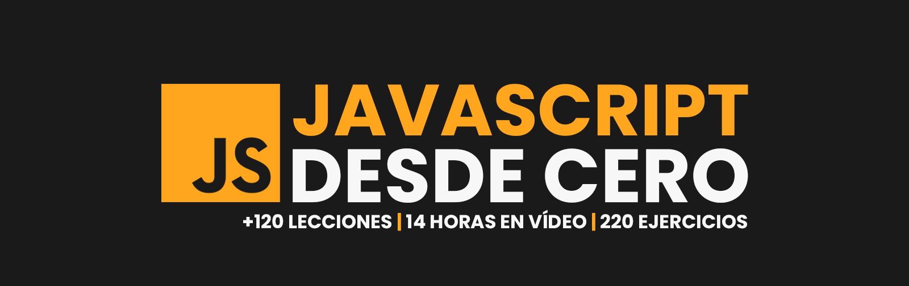

# Hello JavaScript

 

## Curso para aprender el lenguaje de programación JavaScript desde cero y para principiantes

> ##### Si consideras útil el curso, apóyalo haciendo "★ Star" en el repositorio. ¡Gracias!

## Clases en vídeo

### Curso de fundamentos desde cero

* [Introducción](https://youtu.be/1glVfFxj8a4)
* [1 - Contexto](https://youtu.be/1glVfFxj8a4?t=174)
* [2 - Historia](https://youtu.be/1glVfFxj8a4?t=322)
* [3 - JavaScript y Java](https://youtu.be/1glVfFxj8a4?t=665)
* [4 - Utilización](https://youtu.be/1glVfFxj8a4?t=931)
* [5 - Especificación ECMAScript](https://youtu.be/1glVfFxj8a4?t=1017)
* [6 - Motor V8](https://youtu.be/1glVfFxj8a4?t=1293)
* [7 - Referencia](https://youtu.be/1glVfFxj8a4?t=1403)
* [8 - Ejercicios prácticos](https://youtu.be/1glVfFxj8a4?t=1621)
* [9 - Versión](https://youtu.be/1glVfFxj8a4?t=1705)
* [10 - Explorador web](https://youtu.be/1glVfFxj8a4?t=1768)
* [11 - Playground](https://youtu.be/1glVfFxj8a4?t=1893)
* [12 - Instalación](https://youtu.be/1glVfFxj8a4?t=1988)
* [13 - Editor de código](https://youtu.be/1glVfFxj8a4?t=2256)
* [14 - Buenas prácticas](https://youtu.be/1glVfFxj8a4?t=2311)
* [15 - Hola mundo](https://youtu.be/1glVfFxj8a4?t=2390) | [Código](./Basic/00-helloworld.js)
* [16 - Variables](https://youtu.be/1glVfFxj8a4?t=3049) | [Código](./Basic/01-variables.js)
* [17 - Tipos de datos](https://youtu.be/1glVfFxj8a4?t=3599) | [Código](./Basic/02-datatypes.js)
* [18 - Ejercicios: primeros pasos](https://youtu.be/1glVfFxj8a4?t=4733) | [Ejercicios](./Basic/03-beginner-exercises.js)
* [19 - Operadores](https://youtu.be/1glVfFxj8a4?t=4937) | [Código](./Basic/04-operators.js)
* [20 - Ejercicios: Operadores](https://youtu.be/1glVfFxj8a4?t=6458) | [Ejercicios](./Basic/05-operators-exercises.js)
* [21 - Strings](https://youtu.be/1glVfFxj8a4?t=6565) | [Código](./Basic/06-strings.js)
* [22 - Ejercicios: Strings](https://youtu.be/1glVfFxj8a4?t=7226) | [Ejercicios](./Basic/07-strings-exercises.js)
* [23 - Condicionales](https://youtu.be/1glVfFxj8a4?t=7277) | [Código](./Basic/08-conditionals.js)
* [24 - Ejercicios: Condicionales](https://youtu.be/1glVfFxj8a4?t=8652) | [Ejercicios](./Basic/09-conditionals-exercises.js)
* [25 - Arrays](https://youtu.be/1glVfFxj8a4?t=8741) | [Código](./Basic/10-array.js)
* [26 - Sets](https://youtu.be/1glVfFxj8a4?t=9952) | [Código](./Basic/11-set.js)
* [27 - Maps](https://youtu.be/1glVfFxj8a4?t=10755) | [Código](./Basic/12-map.js)
* [28 - Ejercicios: Estructuras](https://youtu.be/1glVfFxj8a4?t=11451) | [Ejercicios](./Basic/13-structures-exercises.js)
* [29 - Bucles](https://youtu.be/1glVfFxj8a4?t=11575) | [Código](./Basic/14-loops.js)
* [30 - Ejercicios: Bucles](https://youtu.be/1glVfFxj8a4?t=12732) | [Ejercicios](./Basic/15-loops-exercises.js)
* [31 - Funciones](https://youtu.be/1glVfFxj8a4?t=12829) | [Código](./Basic/16-functions.js)
* [32 - Ejercicios: Funciones](https://youtu.be/1glVfFxj8a4?t=14146) | [Ejercicios](./Basic/17-functions-exercises.js)
* [33 - Objetos](https://youtu.be/1glVfFxj8a4?t=14229) | [Código](./Basic/18-objects.js)
* [34 - Ejercicios: Objetos](https://youtu.be/1glVfFxj8a4?t=15675) | [Ejercicios](./Basic/19-objects-exercises.js)
* [35 - Desestructuración y propagación](https://youtu.be/1glVfFxj8a4?t=15747) | [Código](./Basic/20-destructuring-spreading.js)
* [36 - Ejercicios: Desestructuración y propagación](https://youtu.be/1glVfFxj8a4?t=16802) | [Ejercicios](./Basic/21-destructuring-spreading-exercises.js)
* [37 - Clases](https://youtu.be/1glVfFxj8a4?t=16864) | [Código](./Basic/22-classes.js)
* [38 - Herencia de clases](https://youtu.be/1glVfFxj8a4?t=17999) | [Código](./Basic/22-classes.js)
* [39 - Ejercicios: Clases](https://youtu.be/1glVfFxj8a4?t=18630) | [Ejercicios](./Basic/23-classes-exercises.js)
* [40 - Manejo de errores](https://youtu.be/1glVfFxj8a4?t=18751) | [Código](./Basic/24-error-handling.js)
* [41 - Ejercicios: Manejo de errores](https://youtu.be/1glVfFxj8a4?t=20392) | [Ejercicios](./Basic/25-error-handling-exercises.js)
* [42 - Console](https://youtu.be/1glVfFxj8a4?t=20444) | [Código](./Basic/26-console-methods.js)
* [43 - Ejercicios: Console](https://youtu.be/1glVfFxj8a4?t=21421) | [Ejercicios](./Basic/27-console-methods-exercises.js)
* [44 - Módulos](https://youtu.be/1glVfFxj8a4?t=21480) | [Código exportación](./Basic/28-export-modules.js) | [Código importación](./Basic/29-import-modules.js) | [Código externos](./Basic/30-import-external-modules.cjs)
* [45 - Ejercicios: Módulos](https://youtu.be/1glVfFxj8a4?t=22720) | [Ejercicios](./Basic/31-modules-exercises.js) | [package.json](./Basic/package.json)
* [Despedida](https://youtu.be/1glVfFxj8a4?t=22776)

### Curso de fundamentos intermedio (continuación del desde cero)

* [Introducción](https://youtu.be/iJvLAZ8MJ2E)
* [1 - Primeros pasos](https://youtu.be/iJvLAZ8MJ2E?t=279)

Funciones avanzadas | [Código](./Intermediate/00-advanced-functions.js)

* [2 - Ciudadanos de primera clase](https://youtu.be/iJvLAZ8MJ2E?t=346)
* [3 - Arrow functions](https://youtu.be/iJvLAZ8MJ2E?t=782)
* [4 - IIFE](https://youtu.be/iJvLAZ8MJ2E?t=1278)
* [5 - Parámetros rest](https://youtu.be/iJvLAZ8MJ2E?t=1873)
* [6 - Operador Spread](https://youtu.be/iJvLAZ8MJ2E?t=2126)
* [7 - Closures](https://youtu.be/iJvLAZ8MJ2E?t=2356)
* [8 - Recursividad](https://youtu.be/iJvLAZ8MJ2E?t=2650)
* [9 - Funciones parciales](https://youtu.be/iJvLAZ8MJ2E?t=3013)
* [10 - Currying](https://youtu.be/iJvLAZ8MJ2E?t=3473)
* [11 - Callbacks](https://youtu.be/iJvLAZ8MJ2E?t=3675)
* [12 - Ejercicios: Funciones avanzadas](https://youtu.be/iJvLAZ8MJ2E?t=4112) | [Ejercicios](./Intermediate/01-advanced-functions-exercises.js)

Estructuras avanzadas | [Código](./Intermediate/02-advanced-structures.js)

* [13 - Estructuras avanzadas](https://youtu.be/iJvLAZ8MJ2E?t=4355)
* [14 - Arrays avanzados: métodos funcionales](https://youtu.be/iJvLAZ8MJ2E?t=4411)
* [15 - Arrays avanzados: manipulación](https://youtu.be/iJvLAZ8MJ2E?t=5244)
* [16 - Arrays avanzados: ordenación](https://youtu.be/iJvLAZ8MJ2E?t=5621)
* [17 - Arrays avanzados: búsqueda](https://youtu.be/iJvLAZ8MJ2E?t=5979)
* [18 - Sets avanzados: operaciones](https://youtu.be/iJvLAZ8MJ2E?t=6288)
* [19 - Sets avanzados: conversión](https://youtu.be/iJvLAZ8MJ2E?t=6949)
* [20 - Sets avanzados: iteración](https://youtu.be/iJvLAZ8MJ2E?t=6992)
* [21 - Maps avanzados: iteración](https://youtu.be/iJvLAZ8MJ2E?t=7061)
* [22 - Maps avanzados: conversión](https://youtu.be/iJvLAZ8MJ2E?t=7207)
* [23 - Ejercicios: Estructuras avanzadas](https://youtu.be/iJvLAZ8MJ2E?t=7514) | [Ejercicios](./Intermediate/03-advanced-structures-exercises.js)

Objetos y clases avanzados | [Código Objetos](./Intermediate/04-advanced-objects.js) | [Código Clases](./Intermediate/05-advanced-classes.js)

* [24 - Objetos avanzados](https://youtu.be/iJvLAZ8MJ2E?t=7639)
* [25 - Prototipos](https://youtu.be/iJvLAZ8MJ2E?t=7695)
* [26 - Herencia](https://youtu.be/iJvLAZ8MJ2E?t=8068)
* [27 - Métodos estáticos y de instancia](https://youtu.be/iJvLAZ8MJ2E?t=8577)
* [28 - Métodos avanzados](https://youtu.be/iJvLAZ8MJ2E?t=8896)
* [29 - Clases avanzadas](https://youtu.be/iJvLAZ8MJ2E?t=9096)
* [30 - Abstracción](https://youtu.be/iJvLAZ8MJ2E?t=9408)
* [31 - Polimorfismo](https://youtu.be/iJvLAZ8MJ2E?t=9694)
* [32 - Mixins](https://youtu.be/iJvLAZ8MJ2E?t=9956)
* [33 - Singleton](https://youtu.be/iJvLAZ8MJ2E?t=10454)
* [34 - Symbol](https://youtu.be/iJvLAZ8MJ2E?t=10901)
* [35 - instanceof](https://youtu.be/iJvLAZ8MJ2E?t=11264)
* [36 - create](https://youtu.be/iJvLAZ8MJ2E?t=11331)
* [37 - Proxy](https://youtu.be/iJvLAZ8MJ2E?t=11375)
* [38 - Ejercicios: Objetos y clases avanzados](https://youtu.be/iJvLAZ8MJ2E?t=11832) | [Ejercicios](./Intermediate/06-advanced-objects-classes-exercises)

Asincronía | [Código](./Intermediate/07-async.js)

* [39 - Asincronía](https://youtu.be/iJvLAZ8MJ2E?t=11890)
* [40 - Código síncrono](https://youtu.be/iJvLAZ8MJ2E?t=12245)
* [41 - Event Loop](https://youtu.be/iJvLAZ8MJ2E?t=12366)
* [42 - Callbacks](https://youtu.be/iJvLAZ8MJ2E?t=12729)
* [43 - Promesas](https://youtu.be/iJvLAZ8MJ2E?t=13349)
* [44 - Async/Await](https://youtu.be/iJvLAZ8MJ2E?t=14171)
* [45 - Ejercicios: Asincronía](https://youtu.be/iJvLAZ8MJ2E?t=14558) | [Ejercicios](./Intermediate/08-async-exercises.js)

APIs | [Código](./Intermediate/09-apis.js)

* [46 - APIs](https://youtu.be/iJvLAZ8MJ2E?t=14777)
* [47 - API REST](https://youtu.be/iJvLAZ8MJ2E?t=14973)
* [48 - Métodos HTTP](https://youtu.be/iJvLAZ8MJ2E?t=15134)
* [49 - Códigos de respuesta HTTP](https://youtu.be/iJvLAZ8MJ2E?t=15294)
* [50 - GET](https://youtu.be/iJvLAZ8MJ2E?t=15477)
* [51 - Async/Await en APIs](https://youtu.be/iJvLAZ8MJ2E?t=16400)
* [52 - POST](https://youtu.be/iJvLAZ8MJ2E?t=16626)
* [53 - Herramientas para realizar peticiones HTTP](https://youtu.be/iJvLAZ8MJ2E?t=17088)
* [54 - Manejo de errores](https://youtu.be/iJvLAZ8MJ2E?t=17325)
* [55 - Métodos HTTP adicionales](https://youtu.be/iJvLAZ8MJ2E?t=17619)
* [56 - Autenticación mediante API Key](https://youtu.be/iJvLAZ8MJ2E?t=17770)
* [57 - Otros métodos de autenticación y autorización](https://youtu.be/iJvLAZ8MJ2E?t=18244)
* [58 - Versionado de APIs](https://youtu.be/iJvLAZ8MJ2E?t=18323)
* [59 - Otras APIs](https://youtu.be/iJvLAZ8MJ2E?t=18441)
* [60 - Ejercicios: APIs](https://youtu.be/iJvLAZ8MJ2E?t=18710) | [Ejercicios](./Intermediate/10-apis-exercises.js)

DOM | [Código](./Intermediate/11-dom.js)

* [61 - DOM](https://youtu.be/iJvLAZ8MJ2E?t=18822)
* [62 - Estructura del DOM](https://youtu.be/iJvLAZ8MJ2E?t=19105)
* [63 - Métodos de selección](https://youtu.be/iJvLAZ8MJ2E?t=19172)
* [64 - Manipulación de elementos](https://youtu.be/iJvLAZ8MJ2E?t=19792)
* [65 - Modificación de atributos](https://youtu.be/iJvLAZ8MJ2E?t=19996)
* [66 - Interacción con clases CSS](https://youtu.be/iJvLAZ8MJ2E?t=20326)
* [67 - Creación y eliminación de elementos](https://youtu.be/iJvLAZ8MJ2E?t=20787)
* [68 - Elementos y eventos del DOM](https://youtu.be/iJvLAZ8MJ2E?t=21377)
* [69 - Ejemplos: acceso al DOM](https://youtu.be/iJvLAZ8MJ2E?t=21754) | Ejemplo simple: [HTML](./Intermediate/12-dom-example.html) - [JS](./Intermediate/13-dom-example.js)
* [70 - Ejemplos: lista de tareas](https://youtu.be/iJvLAZ8MJ2E?t=22342) Ejemplo lista de tareas: [HTML](./Intermediate/14-tasklist.html) - [JS](./Intermediate/15-tasklist.js)
* [71 - Ejercicios: DOM](https://youtu.be/iJvLAZ8MJ2E?t=23010) | [Ejercicios](./Intermediate/16-dom-exercises.js)

Depuración | [Código](./Intermediate/17-debugging.js)

* [72 - Depuración](https://youtu.be/iJvLAZ8MJ2E?t=23085)
* [73 - Depurador](https://youtu.be/iJvLAZ8MJ2E?t=23370)
* [74 - Ejercicios: Depuración](https://youtu.be/iJvLAZ8MJ2E?t=24329) | [Ejercicios](./Intermediate/18-debugging-exercises.js)

Regex | [Código](./Intermediate/19-regex.js)

* [75 - Regex](https://youtu.be/iJvLAZ8MJ2E?t=24363)
* [76 - Sintaxis: test](https://youtu.be/iJvLAZ8MJ2E?t=24444)
* [77 - Sintaxis: replace](https://youtu.be/iJvLAZ8MJ2E?t=24989)
* [78 - Sintaxis: exec](https://youtu.be/iJvLAZ8MJ2E?t=25365)
* [79 - Ejercicios: Regex](https://youtu.be/iJvLAZ8MJ2E?t=25888) | [Ejercicios](./Intermediate/20-regex-exercises.js)

Testing | [Código](./Intermediate/21-testing.js) | [Test](./Intermediate/22-testing.test.js)

* [80 - Testing](https://youtu.be/iJvLAZ8MJ2E?t=25938)
* [81 - Jest](https://youtu.be/iJvLAZ8MJ2E?t=26272)
* [82 - Ejercicios: Testing](https://youtu.be/iJvLAZ8MJ2E?t=26946) | [Ejercicios](./Intermediate/23-testing-exercises.js)
* [Despedida](https://youtu.be/iJvLAZ8MJ2E?t=26970)

## Enlaces de interés

* Impacto: [Stack Overflow](https://survey.stackoverflow.co/2023/#most-popular-technologies-language) | [GitHub](https://github.blog/2023-11-08-the-state-of-open-source-and-ai/) | [Índice TIOBE](https://www.tiobe.com/tiobe-index/) | [Google Trends](https://trends.google.es/trends/explore?cat=5&date=today%205-y&q=%2Fm%2F02p97,%2Fm%2F05z1_,%2Fm%2F07sbkfb&hl=es)
* [Historia](https://es.wikipedia.org/wiki/JavaScript)
* [Especificación ECMAScript](https://tc39.es/ecma262/)
* [Documentación Mozilla](https://developer.mozilla.org/es/docs/Web/JavaScript)
* [Documentación W3Schools](https://www.w3schools.com/js/)
* [Documentación JS Info](https://es.javascript.info/)
* [Libro Eloquent JavaScript](https://eloquentjavascript.net/)
* [Playground](https://runjs.app/play)
* [Node.js](https://nodejs.org)
* Exploradores: [Chrome](https://www.google.com/intl/es_es/chrome/) | [Brave](https://brave.com/download/)
* [Visual Studio Code](https://code.visualstudio.com/)
* [Guía de estilo](https://google.github.io/styleguide/jsguide.html)
* Clientes HTTP: [Postman](https://postman.com) | [Apidog](https://apidog.com) | [Thunder Client](https://thunderclient.com)
* APIs: [JSONPlaceholder](https://jsonplaceholder.typicode.com) | [OpenWeather](https://openweathermap.org) | [PokéAPI](https://pokeapi.co)
* Expresiones regulares: [Documentación](https://developer.mozilla.org/es/docs/Web/JavaScript/Guide/Regular_expressions/Cheatsheet
) | [Regex101](https://regex101.com/)
* [Jest](https://jestjs.io/)

#### ¿Cómo puedo practicar?
En cada lección encontrarás ejercicios para poner en práctica lo aprendido. También puedes realizar los ejercicios en [retosdeprogramacion.com](https://retosdeprogramacion.com).

